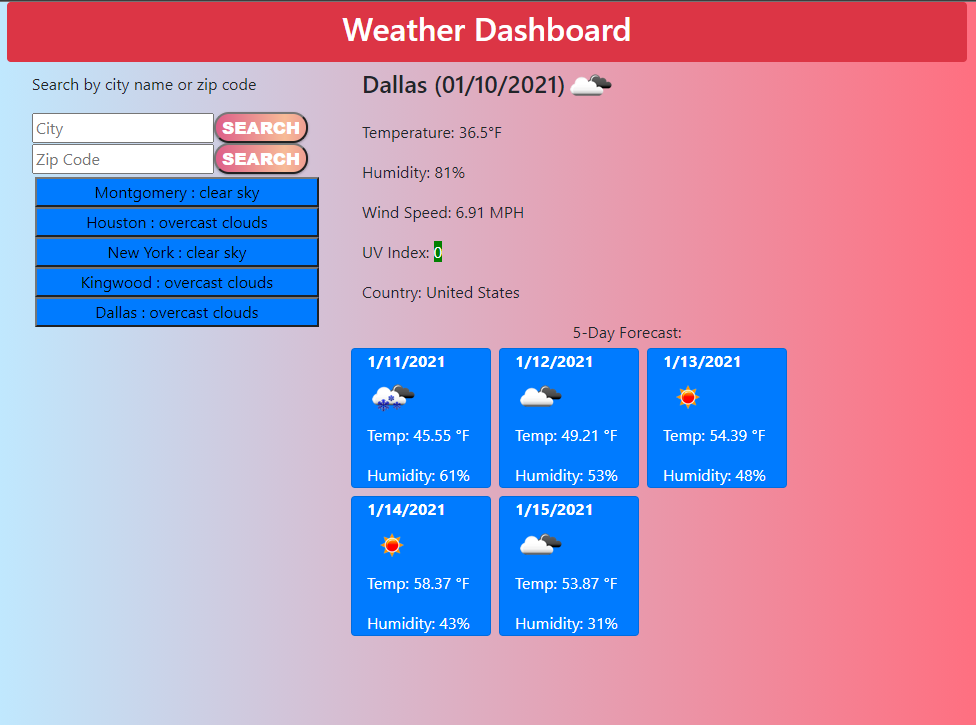

# weather-side
This is my weather app with 5-days forecast using open weather API calls. 

## Description

This application requires Javascript and jQuery to run properly. 

You can contact me with any suggestions and improvements to the app. 

[Tony Tran](mailto:codemonkey713@gmail.com?subject=[GitHub]weather-dashboard)

Here is a link to the deployed project. 

<https://code-monkey713.github.io/weather-side/>

## Installation

You can open the app on the browser to view the content. There are no special instructions for this application.  

## Usage

The app will open up with a a field to search by the city name. Once the city name is entered, either click on the 'search' button or press 'Enter' on your keyboard to initiate the search. Your current weather and 5-days forecast will appear if you entered a valid city name. 

Your search history will appear on the left hand side where you can click on to jump back to the weather for the city you selected. 

Please follow the link to go to the weather dashboard app up above. Screenshot provided below for reference.

## Credits

I would like to give credit to my instructor Tish McNeel for helping me solve some issues with getting the text value out of the dynamic buttons created for click events. 

References:

https://momentjs.com

https://api.jquery.com

https://home.openweathermap.org/

https://uigradients.com/

https://html-online.com/articles/gradient-background-buttons-css-html/

https://stackoverflow.com/questions/13011313/storing-ajax-response-array-into-a-variable-for-later-usage/23842196

https://coderrocketfuel.com/article/convert-a-unix-timestamp-to-a-date-in-vanilla-javascript

https://www.epa.gov/sunsafety/uv-index-scale-0

https://gist.github.com/maephisto/9228207

## License

There is no license for this project. 
